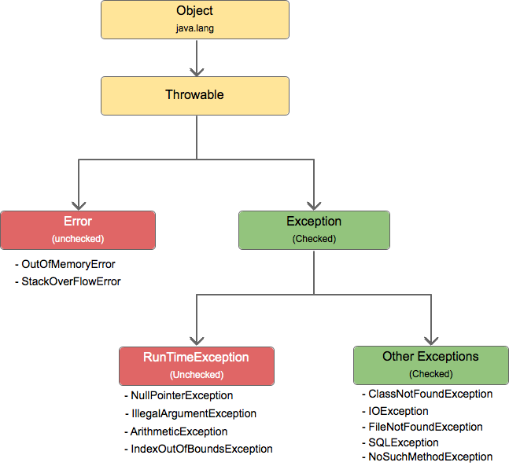

# Exceptions
- exception hierarchy
- 

## Try to generate:
- NullPointerException - folosirea unei referințe cu valoarea null pentru accesarea unui membru public sau default dintr-o clasă;
- ArrayIndexOutOfBoundsException - folosirea unui index incorect, respectiv negativ sau strict mai mare decât dimensiunea fizică a unui tablou - 1;
- StringIndexOutOfBoundsException - folosirea unui index incorect cand manipulam un sir de caractere
- ArithmeticException - operații aritmetice nepermise, precum împărțirea unui număr întreg la 0;
- IllegalArgumentException – utilizarea incorectă a unui argument pentru o metodă. O subclasă a clasei IllegalArgumentException este NumberFormatException care corespunde erorilor de conversie a unui String într-un tip de date primitiv din cadrul metodelor parseTipPrimitiv ale claselor wrapper;
- ClassCastException - apare la conversia unei referințe către un alt tip de date incompatibil;

## Other exceptions:
- IOException - apare în operațiile de intrare/ieșire (de exemplu, citirea dintr-un fișier sau din rețea). O subclasă a clasei IOException este FileNotFoundException, generată în cazul încercării de deschidere a unui fișier inexistent;
- SQLException - excepții care apar la interogarea serverelor de baze de date.

## Control Flow
- write a void method that throws an unchecked exception and wrap the part that throws exception in a try catch
- copy the method and use a try catch finally
- copy the method and use a try finally
- use return in the try or catch block

- multicatch - same hierarchy, different hierarchies - read from the keyboard - take the input and use Integer.parseInt() and divide by it - account for division by 0 and for parsing non-numbers

- define two custom exceptions - one that's checked and one that's unchecked - throw them in some methods and catch them

- create a class with one method, then subclass it and override the method and declare it throws an exception

- try with resources - after we work with files

# Files
- check the premade classes
