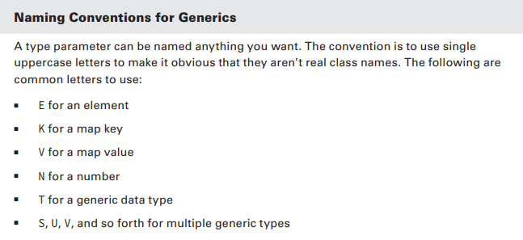
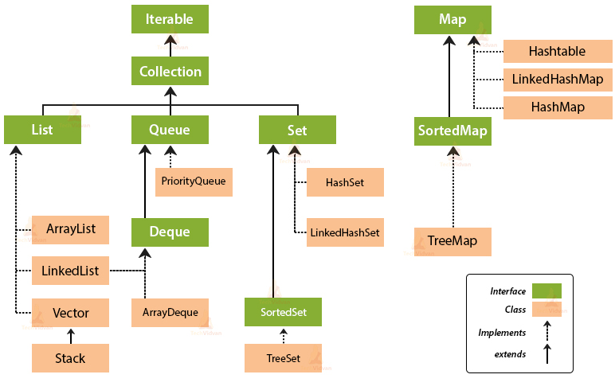

# Generics & Collections
- create an array with Strings and an array with ints
- check out ArrayList in terms of types that it can hold and its length - wrapper classes +
 
Whenever an instance of ArrayList in Java is created then by default the capacity of Arraylist is 10. Since ArrayList is a growable array, it automatically resizes itself whenever a number of elements in ArrayList grow beyond a threshold)

## The Diamond Operator: <> - parameterized types
```String[] strings = new String[2];
    List something = new ArrayList(); // create a list without generics -> add an Integer to it, cast it to String
    List<String> names = new ArrayList<>();
```

- create a simple class Book with a field title and override the toString method
- create a generic class Box with a generic type - have a field of that generic type and have a method that sets the field (add)
- in main create one Box object, which holds different types - String, Integer, Book and print them out (one by one) - raw use
- create multiple Box objects, parameterized, that hold the same types as above


  

## Bounded types: ? wildcard
- create two classes that extend Book - Novel & ColoringBook (override toString to be clear in which class we are)
- create a generic method that takes a generic type and returns a Box of that type
- create a generic method that is upper bounded and takes only objects that extend Book and prints the object
- create a generic method that is lower bounded and takes only objects that are super of Book

# Collections detailed



