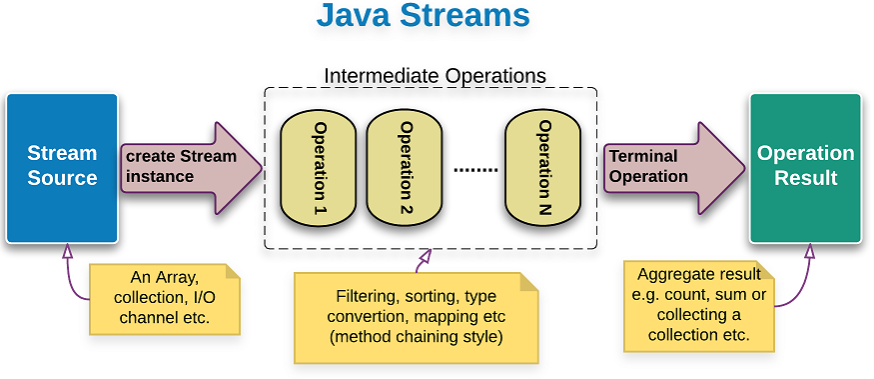

# Streams

- create a class Book, with title, author and year of publication
- in main add 7 books to a list
- filter all books older than 2000
- print them by year

- now do the same with stream, filter, sorted and forEach

## Creating streams
- from existing collection
- with Stream.of
- with Arrays.stream
- with Stream.generate

## Intermediate operations
- filter
- sorted
- distinct
- map
- flatMap
- peek
- limit
- skip

## Terminal Operations
- forEach
- max
- min
- sum
- collect
- groupingBy
- anyMatch
- findFirst
