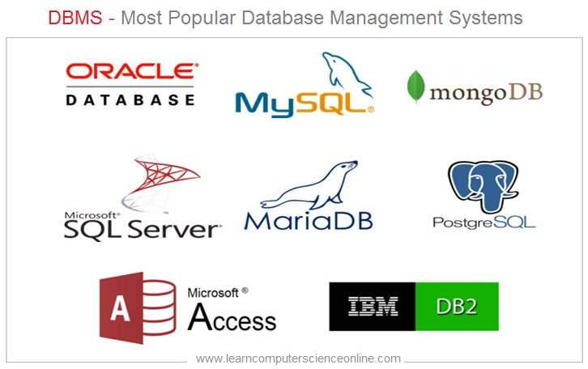
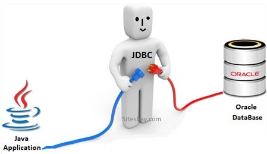
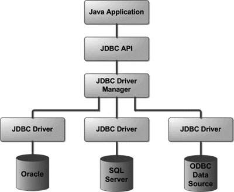
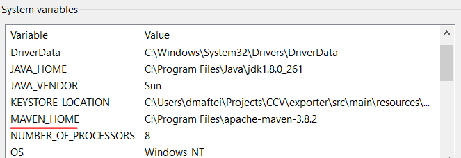
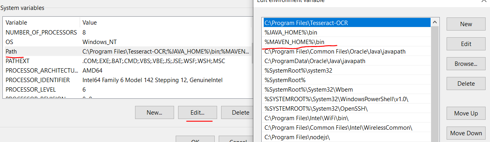
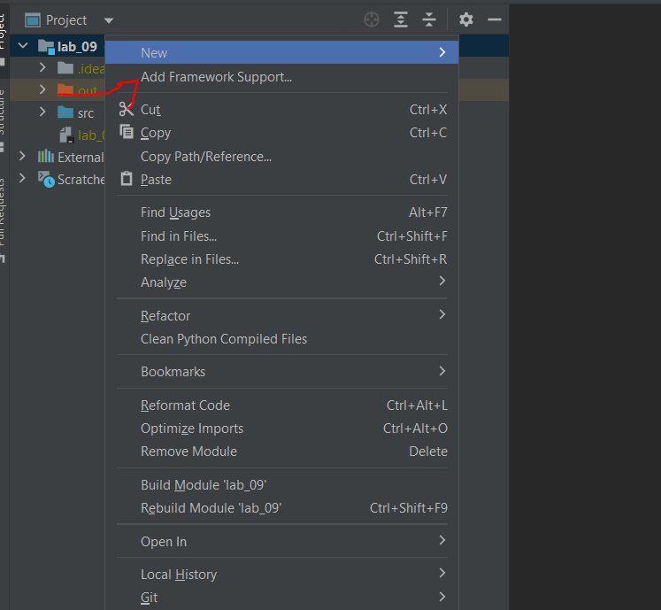

# JDBC (Java DataBase Connectivity)
- each DB is managed by a DBMS - database management system

- JDBC is API for connecting to a DB and executing SQL scripts

- for each DBMS there are drivers to connect to it (locally installed programs)

## Connecting to a DB - MySql
1. Download and Install MySql workbench (that comes with the server) - remember the password you used
2. Add mysql connector library to project
   1. Download and unzip Maven: https://maven.apache.org/download.cgi
   2. Add MAVEN_HOME to environment variables and bin directory to the PATH environment variable 
   3. Add Maven support to project - right click in intellij - add framework support - maven
   4. In pom.xml, in the dependencies tag, add mysql maven dependency from https://mvnrepository.com/artifact/mysql/mysql-connector-java/8.0.29 
3. Create a configuration class to setup the connection
   1. set url, user and password - in real projects these are secrets and not saved in clear in the class
   2. use the DriverManager class to get a connection and to close the connection
4. Create a repository class to run sql statements
   - JDBC offers 3 types of interfaces to run our queries (check out mysql implementation classes):
      - Statement – for simple SQL commands, without parameters
      - PreparedStatement – for parameterized SQL commands (extends Statement)
      - CallableStatement – for calling functions and stored procedures (extends PreparedStatement)
   - They each have the following methods:
      - boolean **execute()** - Executes the SQL statement, which may be any kind of SQL statement, and returns true if the first result is a ResultSet object or false if it is an update count or there are no results
      - ResultSet **executeQuery()** - Executes the SQL query and returns the ResultSet object generated by the query.
      - int **executeUpdate()** - Executes the SQL statement, which must be an SQL INSERT, UPDATE or DELETE statement; or an SQL statement that returns nothing, such as a DDL statement.
