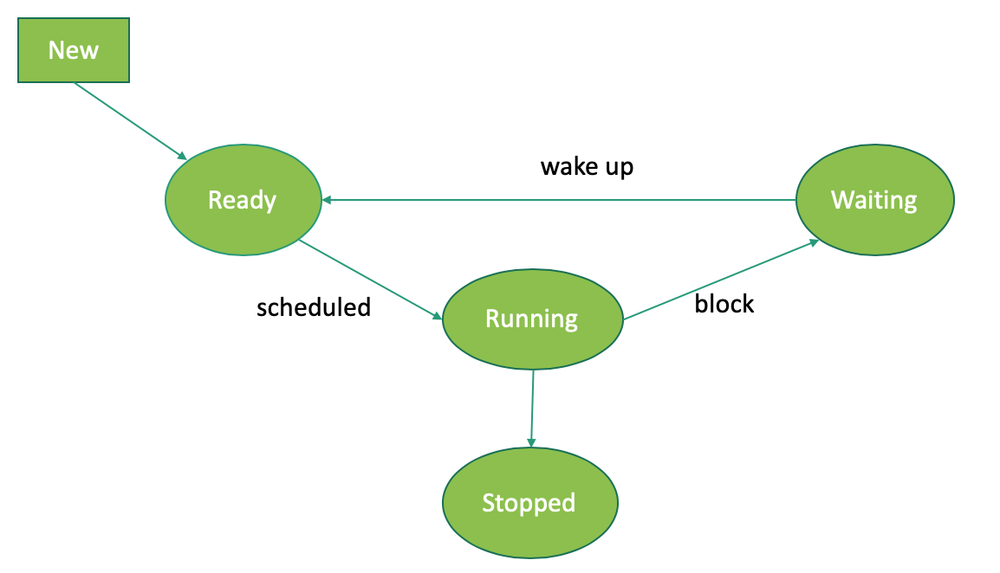

# Multithreading

## Creating and running multiple threads
- by extending Thread, overriding run(), and calling start() 
- by implementing Runnable, implementing the method run(), passing it as a parameter to Thread and calling start()

## Thread states

### Controlling the flow
- use join() to suspend the running of the parent thread until the current thread finishes
- use sleep() to suspend execution for a certain period of time
- use wait() to wait for a shared resource, continue running by calling notify() or notifyAll()
- use interrupt() to stop the thread 
- use synchronized when multiple threads access the same resource

# Review material
https://sites.google.com/view/curspao2022

# Extra sample exam questions
https://ocw.cs.pub.ro/courses/poo-ca-cd/test/index
https://www.javatpoint.com/core-java-quiz
